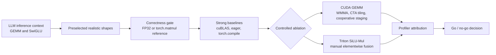

# Profile-Driven GPU Kernel Lab for LLM Inference

A reproducible CUDA/Triton performance study built around realistic LLM
inference operators. The project is intentionally not a kernel zoo: each study
starts from a strong baseline, validates correctness, profiles representative
shapes, tests one controlled optimization hypothesis, and ends with an explicit
go/no-go decision.

This repository is the operator-level counterpart to a nano-vLLM systems study
covering scheduler interference, KV-cache metrics, serving profiling, and
decode-aware chunked prefill. Together they show system-level and kernel-level
performance reasoning.

## Results At A Glance

| Study | Question | RTX 4090 result | Decision |
|---|---|---|---|
| CUDA Tensor Core GEMM | Does cross-warp cooperative staging remove an important limitation in the fixed 64x32 WMMA kernel? | **1.32-1.58x** over the previous block-tiled custom kernel on three preselected LLM shapes | Hypothesis supported; stop before an open-ended CUTLASS-style redesign |
| Fused SiLU-Mul | When does manual Triton fusion help relative to eager PyTorch and `torch.compile`? | Up to **1.97x** over eager on large prefill; compiler-generated and manual fused kernels were within about **2-6%** GPU time | Fusion is shape-dependent; no further manual tuning justified |

The custom GEMM is not presented as cuBLAS-competitive: the final variant is
still 3.65-7.99x slower than cuBLAS. The value of the study is the measured
optimization loop and the explanation of that remaining gap.

## Engineering Loop



The same discipline is used in both studies:

```text
baseline audit
-> correctness first
-> realistic shape sweep
-> repeat statistics
-> profiler evidence
-> bottleneck hypothesis
-> controlled implementation change
-> go/no-go
```

## Study 1: CUDA GEMM Optimization

Implemented variants:

```text
naive CUDA
-> shared-memory tiling
-> register blocking
-> vectorized load
-> single-warp WMMA Tensor Core path
-> 64x32 multi-warp CTA tiling
-> cooperative A/B shared-memory staging
```

The final experiment kept the CTA tile, warp count, and WMMA compute path fixed.
It changed A/B staging from per-warp private loads to CTA-cooperative loading,
testing whether repeated staging was an important performance limitation.

| Shape (M x N x K) | Block-tiled | Cooperative staging | Improvement | cuBLAS | Gap vs cuBLAS |
|---|---:|---:|---:|---:|---:|
| Qwen up, 128 x 18944 x 4096 | 1.1592 ms | **0.7322 ms** | **1.58x** | 0.2004 ms | 3.65x |
| LLaMA down, 128 x 4096 x 11008 | 1.2247 ms | **0.9267 ms** | **1.32x** | 0.1160 ms | 7.99x |
| Prefill, 512 x 4096 x 4096 | 0.7085 ms | **0.4997 ms** | **1.42x** | 0.1116 ms | 4.48x |

Correctness passed and PyTorch profiler reproduced the same ordering. Profiler
kernel signatures also indicated shape-specific cuBLAS variants with different
macro-tile characteristics, while the custom implementation used one fixed
mapping. This supports shape-aware kernel selection and a deeper Tensor Core
pipeline as major parts of the remaining cuBLAS advantage.

Full methodology, profiler tables, and limitations:
[CUDA GEMM study](studies/cuda_gemm/README.md).

## Study 2: Fused SiLU-Mul

The SwiGLU activation path uses the FP32 correctness reference:

```python
ref = torch.nn.functional.silu(gate.float()) * up.float()
```

The benchmark separates three implementations: eager PyTorch with two GPU
kernels, a standalone `torch.compile` function, and one manual Triton kernel.

| Representative shape | Eager isolated | compile isolated | Triton isolated | Interpretation |
|---|---:|---:|---:|---|
| LLaMA decode, 1 x 11008 | **0.0213 ms** | 0.0625 ms | 0.0366 ms | Isolated-call overhead dominates |
| LLaMA prefill, 1024 x 11008 | 0.0809 ms | 0.0625 ms | **0.0410 ms** | Triton is 1.97x over eager |
| Qwen prefill, 512 x 18944 | 0.0389 ms | 0.0622 ms | 0.0386 ms | Eager and Triton are statistically tied |

Profiler evidence confirmed that `torch.compile` emitted one
`triton_poi_fused_mul_silu` kernel. On the two larger profiler shapes, its GPU
execution time was within about 2-6% of the manual Triton kernel. The larger
standalone-call latency difference came from runtime dispatch, Dynamo cache
lookup, output allocation, and launch-path overhead, not from a fundamentally
better manual kernel. Initial compilation was outside the timed region.

The effective GB/s metric uses logical minimum traffic and repeated hot tensors;
it is not used as evidence of HBM saturation. Full results and profiler
attribution: [Fused SiLU-Mul study](studies/fused_silu_mul/README.md).

## Claims And Limits

This project demonstrates:

- FP16 CUDA and WMMA Tensor Core implementation
- shared-memory tiling, register blocking, and cross-warp data reuse
- Triton elementwise fusion and comparison with compiler-generated fusion
- correctness-first benchmarking with p20/p50/p80 repeat statistics
- shape-aware performance analysis and negative-result discipline

It does not claim:

- a GEMM that outperforms or is competitive with cuBLAS
- general superiority of manual Triton over `torch.compile`
- production-level CUTLASS, FlashAttention, W4A16, or TensorRT kernels
- hardware-counter attribution; AutoDL denied Nsight Compute counter access

## Repository Layout

```text
studies/
  cuda_gemm/
    kernels/gemm_kernels.cu
    gemm_ops.py
    shapes.py
    benchmark.py
    profiler.py
    README.md
  fused_silu_mul/
    fused_silu_mul.py
    shapes.py
    benchmark.py
    profiler.py
    README.md
docs/
  INTERVIEW_GUIDE.md
archive/
  seeds/
```

## Reproduce On RTX 4090

Local Windows is used only for editing and documentation. Official performance
results come from AutoDL RTX 4090 with PyTorch `2.1.2+cu121`, Triton `2.1.0`,
and CUDA `12.1`. Cloud commands use `--no-write`; raw outputs are not committed.

```bash
pip install -r requirements.txt

python studies/cuda_gemm/benchmark.py \
  --dtype float16 --warmup 20 --repeat 100 \
  --shapes wmma_shape_diagnostic \
  --providers torch_matmul cuda_wmma cuda_wmma_block_tiled cuda_wmma_shared_tiles \
  --no-write

python studies/fused_silu_mul/benchmark.py \
  --dtype float16 --warmup 25 --repeat 100 --amortized-inner 100 \
  --shapes silu_official_rtx4090 \
  --no-write
```

The profiler commands and exact analysis rules are documented inside each study.
For a concise technical walkthrough and defensible resume wording, see the
[interview guide](docs/INTERVIEW_GUIDE.md).
